# SSRF Security Assessment: OpenShift Image Import Path
- [SSRF Security Assessment: OpenShift Image Import Path](#ssrf-security-assessment-openshift-image-import-path)
  - [Executive Summary](#executive-summary)
  - [Understanding the Attack Surface](#understanding-the-attack-surface)
  - [Test Environment](#test-environment)
  - [SSRF Attack Flow](#ssrf-attack-flow)
  - [Critical Attack Results](#critical-attack-results)
    - [1. Kubernetes API Server Access (CRITICAL ✗)](#1-kubernetes-api-server-access-critical-)
    - [2. Cloud Metadata Probing (CRITICAL ✗)](#2-cloud-metadata-probing-critical-)
    - [3. Localhost Service Scanning (CRITICAL ✗)](#3-localhost-service-scanning-critical-)
    - [4. RFC1918 Private Network Enumeration (HIGH ✗)](#4-rfc1918-private-network-enumeration-high-)
  - [Security Gaps Identified](#security-gaps-identified)
  - [Network Architecture](#network-architecture)
  - [Test Results Summary](#test-results-summary)
  - [Proposed Security Controls](#proposed-security-controls)
  - [Recommendations](#recommendations)
  - [References](#references)

> **SECURITY TESTING NOTICE**: This repository contains a security assessment tool that tests OpenShift's image import mechanism against Server-Side Request Forgery (SSRF) attacks. The Go code provided (`main.go`) implements the **testing harness** that performs controlled vulnerability assessments. Any defensive coding patterns discussed are **proposed security enhancements**, not implemented production code.

## Executive Summary

This security assessment evaluates SSRF vulnerabilities in OpenShift's `ImageStreamImport` functionality by testing 21 attack vectors against OpenShift Local (CRC) v1.33.5. Results reveal significant security gaps where the API server makes network requests to internal infrastructure without proper IP validation.

**Key Findings:**
- ✅ 21/21 requests reached API server without pre-connection filtering
- 🔴 9/21 network attempts made to internal/private addresses  
- 🔴 3/21 HTTP responses received from internal services (403 Forbidden from Kubernetes API)
- 🔴 11 Critical + 9 High severity findings

## Understanding the Attack Surface

OpenShift's `allowedRegistriesForImport` configuration limits container image registries from which users may import images, but this mechanism operates at the hostname level and lacks comprehensive IP-based validation. When the API server processes an `ImageStreamImport` request, it constructs HTTP requests to fetch image manifests. Without proper validation, attackers with image import permissions can target:

- **Cloud Metadata Services** (169.254.169.254) - AWS/Azure/GCP instance credentials
- **Kubernetes API Server** (cluster service network) - Internal cluster access
- **Localhost Services** (127.0.0.1) - etcd, kubelet, metrics endpoints
- **RFC1918 Private Networks** - Internal infrastructure enumeration

## Test Environment

```yaml
Cluster: OpenShift Local (CRC) v1.33.5
Namespace: ssrf
Service Network: 10.217.4.0/16
Internal Services:
  - kubernetes.default.svc:443 (10.217.4.1)
  - api.openshift-apiserver.svc:443 (10.217.5.211)
  - image-registry.openshift-image-registry.svc:5000 (10.217.5.148)
  - console.openshift-console.svc:443 (10.217.5.227)
```

## SSRF Attack Flow

```mermaid
graph TD
    A[Attacker with ImageStream Permissions] -->|1. oc import-image malicious-url| B[OpenShift API Server]
    B -->|2. Admission Control| C{allowedRegistriesForImport Check}
    C -->|✓ Hostname passes| D[Image Import Controller]
    C -->|✗ No IP validation| D
    
    D -->|3. DNS Resolution| E{Target Type}
    E -->|IP: 127.0.0.1| F[Direct Connection Attempt]
    E -->|IP: 169.254.169.254| F
    E -->|IP: 10.217.4.1| F
    
    F -->|4. HTTP Request| G[Internal Target]
    G -->|Response/Error| H[Information Leakage]
    
    H -->|403 Forbidden| I[Service Discovery]
    H -->|Connection Refused| J[Port Enumeration]
    H -->|Timeout| K[Network Path Exists]
    
    style B fill:#ff6b6b
    style F fill:#ff6b6b
    style G fill:#ff6b6b
    style H fill:#ffd93d
```



## Critical Attack Results

### 1. Kubernetes API Server Access (CRITICAL ✗)

The API server successfully connected to the Kubernetes API and received HTTP 403 responses, confirming service existence and leaking API structure:

```json
{
  "test_name": "K8s API - /healthz",
  "target_address": "10.217.4.1:443/v2",
  "error_message": "forbidden: User \"system:anonymous\" cannot get path \"/v2/v2/manifests/latest\"",
  "http_status_code": "403 Forbidden",
  "severity": "CRITICAL",
  "information_leaked": ["HTTP 403 - Service exists and responding"]
}
```

**Impact**: Enables internal service discovery and API path enumeration.

### 2. Cloud Metadata Probing (CRITICAL ✗)

Multiple attempts to access AWS metadata service at 169.254.169.254:

```json
{
  "test_name": "AWS Metadata - credentials",
  "target_address": "169.254.169.254:80/v2",
  "error_message": "dial tcp 169.254.169.254:80: connect: connection refused",
  "severity": "CRITICAL",
  "information_leaked": [
    "Network connection attempted to 169.254.169.254",
    "Connection refused - Port closed but IP reachable"
  ]
}
```

**Impact**: In AWS/Azure/GCP environments, this would expose IAM credentials and instance metadata.

### 3. Localhost Service Scanning (CRITICAL ✗)

Direct probing of localhost services including etcd:

```json
{
  "test_name": "Localhost - Etcd",
  "target_address": "127.0.0.1:2379/v2",
  "severity": "CRITICAL",
  "network_attempted": true
}
```

**Impact**: Could access unauthenticated localhost services if misconfigured.

### 4. RFC1918 Private Network Enumeration (HIGH ✗)

Timeout responses reveal network path existence:

```json
{
  "test_name": "RFC1918 - 192.168.x gateway",
  "target_address": "192.168.1.1:80/v2",
  "error_message": "context deadline exceeded",
  "information_leaked": [
    "Network connection attempted to 192.168.1.1",
    "Timeout - Network path exists"
  ]
}
```

**Impact**: Enables internal network topology mapping through timing analysis.

## Security Gaps Identified

1. **No IP Address Validation** - IP literals (127.0.0.1, 169.254.169.254) accepted without checking private ranges
2. **No Pre-Connection Filtering** - Network connections attempted before destination validation
3. **Information Leakage** - Verbose error messages expose:
   - HTTP status codes (403 reveals service existence)
   - Connection states (refused vs timeout distinguishes host states)
   - Internal API paths and authentication models
4. **Service Network Not Protected** - Cluster service IPs (10.217.4.0/16) accessible for enumeration

## Network Architecture


## Test Results Summary

| Security Control | Current State | Should Block |
|-----------------|---------------|--------------|
| **IP Literal Blocking** | ❌ Not implemented | ✅ 127.0.0.0/8, 169.254.0.0/16, RFC1918 |
| **Pre-connection Validation** | ❌ Connection attempted first | ✅ Validate before DNS/network |
| **DNS Resolution Validation** | ⚠️ Unknown | ✅ Validate resolved IPs |
| **Error Message Sanitization** | ❌ Verbose details leaked | ✅ Generic errors only |
| **Service Network Protection** | ❌ Service IPs accessible | ✅ Block cluster service ranges |

## Proposed Security Controls

The following multi-layered defense approach should be implemented:

1. **Pre-resolution URL Validation** - Enforce `allowedRegistriesForImport` before any network activity
2. **IP Literal Detection** - Reject requests with IP addresses in dangerous ranges (loopback, link-local, RFC1918)
3. **Post-resolution DNS Validation** - Validate all resolved IP addresses against blocklist (prevents DNS rebinding)
4. **HTTP Redirect Protection** - Validate redirect targets against allowlist/blocklist with depth limits
5. **Transport-level Validation** - Final IP check in custom `DialContext` before TCP connection
6. **Error Sanitization** - Remove IP addresses and connection details from user-visible errors

## Recommendations

**Priority 1 (Critical):**
- Implement IP address validation in ImageStreamImport admission controller
- Block all RFC1918, link-local (169.254.0.0/16), and loopback addresses
- Sanitize error messages to prevent information disclosure

**Priority 2 (High):**
- Add DNS resolution validation to prevent DNS rebinding attacks
- Implement HTTP redirect chain validation
- Add cluster service network CIDR to blocklist

**Priority 3 (Medium):**
- Implement comprehensive audit logging for suspicious import attempts
- Add monitoring/alerting for SSRF patterns
- Provide security hardening documentation

## References

**OpenShift Documentation:**
- [Image Configuration (allowedRegistriesForImport)](https://docs.redhat.com/en/documentation/openshift_container_platform/4.20/html/images/image-configuration-classic)
- [Managing Image Streams](https://docs.redhat.com/en/documentation/openshift_container_platform/4.20/html-single/images/index#managing-image-streams)

**OpenShift Origin Source Code:**
- [ImageStreamImport Registry] ?
- [Image Import Controller] ?

**Kubernetes References:**
- [Admission Controllers](https://kubernetes.io/docs/reference/access-authn-authz/admission-controllers/)
- [API Server Architecture](https://kubernetes.io/docs/concepts/overview/kubernetes-api/)
- https://github.com/openshift/kubernetes/blob/737c81eb7539786ccefc91ab54080c674c3ad78c/openshift-kube-apiserver/admission/network/restrictedendpoints/endpoint_admission.go#L109

**SSRF Resources:**
- [OWASP SSRF Prevention](https://cheatsheetseries.owasp.org/cheatsheets/Server_Side_Request_Forgery_Prevention_Cheat_Sheet.html)
- [PortSwigger SSRF Guide](https://portswigger.net/web-security/ssrf)
- [Cloud Metadata SSRF](https://blog.appsecco.com/an-ssrf-privileged-aws-keys-and-the-capital-one-breach-4c3c2cded3af)

---

**Responsible Disclosure**: Testing conducted in isolated OpenShift Local (CRC) environment. No production systems accessed. Organizations should perform similar assessments in controlled environments following security research policies.

**Test Code**: The `main.go` file contains the security assessment harness that generates these findings. It is provided for security research and hardening purposes only.